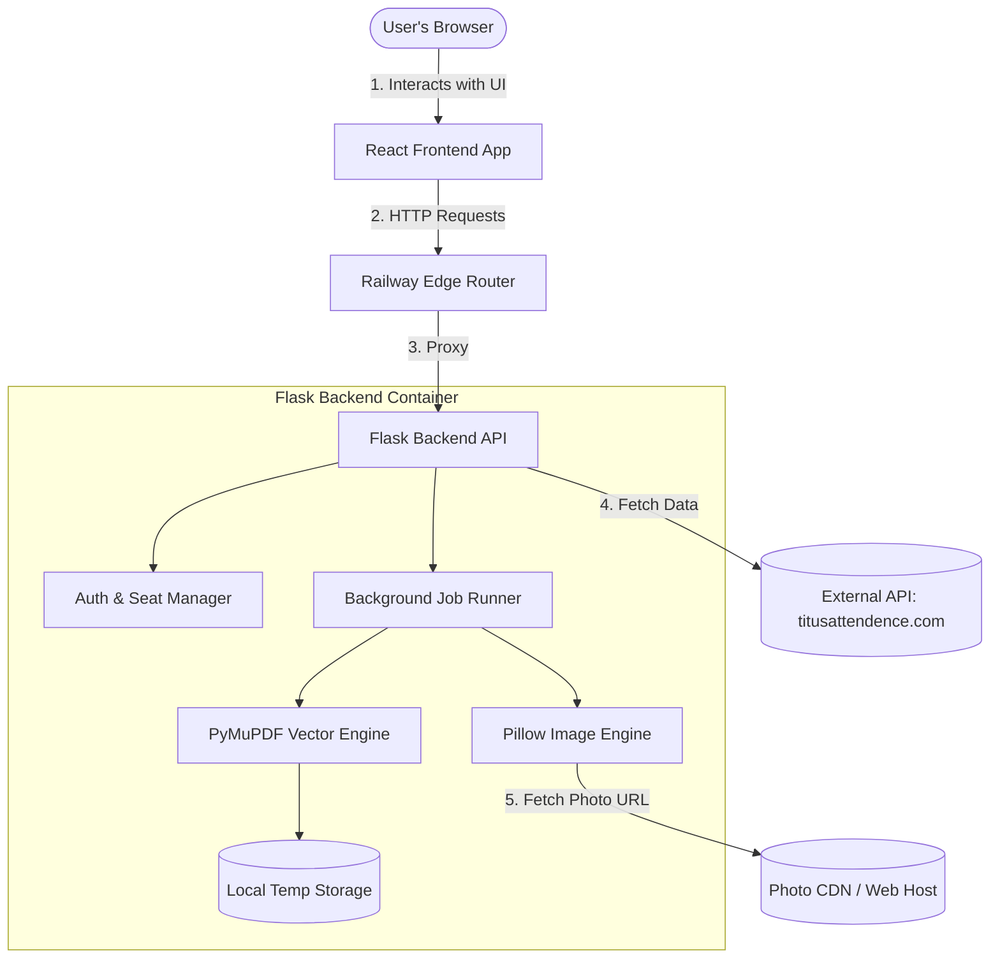
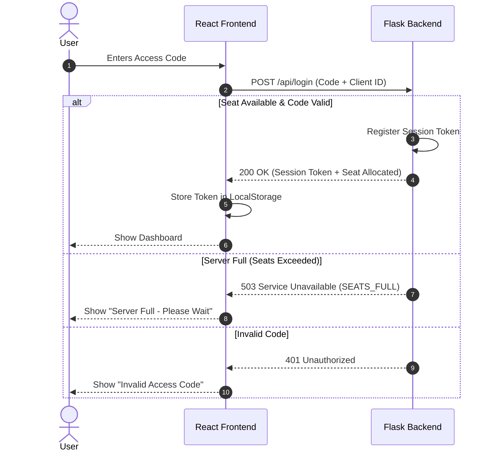
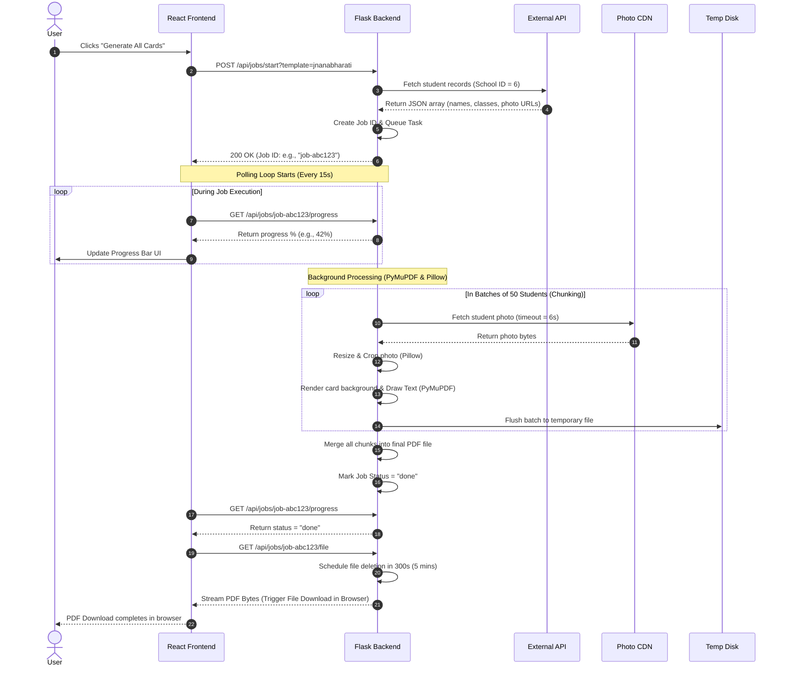

# ID Card Generator System Architecture Document

This document provides a comprehensive, end-to-end breakdown of the **ID Card Generator** application. It is designed to bridge the gap between technical developers and non-technical stakeholders, allowing both to align on how the system operates, why specific technologies were selected, and how data flows through the pipeline.

---

## 1. Executive Summary

### The Problem
Generating high-resolution, print-ready PDF identification cards for hundreds of students or teachers is resource-intensive. Traditional systems often load entire batches of high-resolution photographs and PDF pages into server memory simultaneously. On affordable cloud hosting plans (like a 512 MB RAM / 0.5 CPU container), this immediately triggers **Out Of Memory (OOM)** crashes, slow rendering times, and failed downloads.

### The Solution
The **ID Card Generator** is a lightweight, highly optimized web application that decouples data fetching, image processing, and PDF assembly. It utilizes a **Chunked, Vector-Native Pipeline** that flushes rendered cards to disk periodically rather than keeping them in memory. This allows it to generate bundles of 1,000+ high-resolution ID cards on low-cost cloud infrastructure while maintaining pixel-perfect print quality.

---

## 2. Core Technology Stack

Here is the breakdown of the technologies used in the system, what they do, and why they were chosen:

| Technology | Technical Category | What It Does (Non-Tech) | Why We Chose It (Tech Justification) |
| :--- | :--- | :--- | :--- |
| **React** | Frontend Framework | Builds the user interface (buttons, forms, and progress bars) that the user interacts with in their browser. | Enables modular, state-driven rendering. It allows us to manage complex multi-step forms, display live progress bars, and handle active seat countdowns smoothly. |
| **Python & Flask** | Backend Web Server | Serves as the central brain. It receives requests from the frontend, fetches school data, and coordinates the PDF generation process. | Flask is extremely lightweight and fast to start. Python has mature, production-tested libraries for document generation (PyMuPDF) and image processing (Pillow). |
| **PyMuPDF (Fitz)** | PDF Engine | Opens raw PDF backgrounds, draws text/names on them, overlays photographs, and compiles them into a single file. | Unlike HTML-to-PDF converters (which run a heavy browser engine like Chromium and consume massive RAM), PyMuPDF is a fast, C-compiled vector-native library. It performs assembly at the byte level, keeping RAM usage extremely low. |
| **Pillow (PIL)** | Image Processor | Takes student photos from URLs, crops them to fit ID card dimensions, scales them down to print size, and normalizes formats (PNG/JPEG). | High-res parent uploads can be 5MB–10MB each. Pillow allows us to resize them on-the-fly to tiny, print-optimal dimensions (e.g., 200px wide) before embedding, saving up to 95% of output PDF file size and memory. |
| **Axios** | Network Client | The messenger communication line between the browser (React) and the server (Flask). | Supports interceptors to automatically append security tokens, handle timeouts, and manage custom headers like progress tracking and files. |
| **Railway** | Cloud Infrastructure | Hosts both the frontend and backend servers on the internet so users can access them via custom domains. | Provides seamless GitHub integration for auto-deployments, instant HTTPS, and predictable resource limits (which we optimized the app to respect). |

---

## 3. System Architecture & Design

The application follows a decoupled **Client-Server Architecture**. Below is a high-level block diagram of how the components interact:



### Component Details
1. **React Frontend**: A single-page application (SPA). It is fully static and runs in the user's browser, making it fast and responsive. It coordinates auth, displays school lists, controls filters (e.g., download by class/designation), and triggers download jobs.
2. **Railway Edge Router**: Acts as a reverse proxy. It provides SSL/TLS certificates (HTTPS), routes public requests to the Flask server, and logs traffic.
3. **Flask Backend**: A stateless API server. It does not store persistent database records. Instead, it acts as a dynamic processor.
4. **External Database (titusattendence.com)**: The source of truth containing student names, classes, roll numbers, and remote photo links.
5. **Temporary Storage**: Local disk storage inside the Flask container. Used to stream PDF chunks to disk during construction to avoid RAM exhaustion.

---

## 4. End-to-End Data Flows

### A. Login & Seat Booking Flow
To prevent server OOM crashes and resource abuse, the system implements a **Seat Limit** (e.g., maximum 2 concurrent users).



---

### B. ID Card Generation & Download Flow (Background Job)
For large schools (200+ students), generating a PDF synchronously causes browser timeouts. The app uses an **Asynchronous Job Registry**:



---

## 5. Key Engineering Optimizations (Technical Deep-Dive)

### 1. The Chunked On-Disk PDF Builder
* **The Problem**: A 250-student card PDF sheet is roughly 25MB–40MB on disk. When assembling this in memory, PyMuPDF builds an object tree. For large schools, memory usage spikes above 450MB, causing the Railway container to crash.
* **The Solution**: The background runner processes students in chunks (default = 50 students). After a chunk is generated, it is saved directly to a temporary file on disk (`.chunk.pdf`) and closed.
* **Periodic Compaction**: When merging these chunks into a final PDF, PyMuPDF's object cache accumulates references. Every 30 pages merged, the master document is saved, closed, garbage-collected, and reopened from disk. This drops the active RAM footprint back down to its baseline (~170MB), allowing 1,500-student batches to render safely under a 250MB limit.

### 2. Pillow Aspect-Ratio Aware Scaling (Smart Cover & Contain)
* **Smart Cover (Student Renderers)**: Student photographs vary in dimensions (portrait, landscape, square). The system automatically crops the center of the photo to match the exact placeholder box width and height on the ID card.
* **Contain (Employee Renderers)**: Employee layout photos are often full-length. Centered cropping would cut off legs or heads. The system scales the photo down so the *entire* photo fits inside the card's placeholder, framing the empty margins on a solid white background.
* **JPEG Quality Normalization**: Photos are re-encoded to JPEG at 90% quality with a maximum width of 360 pixels. This produces high-density print outputs (300 DPI) while keeping individual embedded photos under 30KB.

### 3. Connection Pooling & HTTP Resiliency
* School student databases host their images on diverse, sometimes slow third-party web servers. A standard Python script would create a new TCP handshake for every photo fetch.
* The backend implements a shared `urllib3` socket pool with a 3-strike auto-retry handler and custom timeouts (`connect=6s`, `read=12s`). If a school server drops a package, it recovers transparently without failing the entire batch job.

### 4. Delayed PDF Deletion
* **The Problem**: Previously, files were deleted from the server the instant the browser finished downloading. If a network glitch occurred or a mobile browser requested a range resume, the file was already gone, causing a "Network Error".
* **The Solution**: A background thread called `pdf-reaper` sweeps the temp directory every 30 seconds. When a file is served, it is scheduled for deletion **300 seconds (5 minutes) in the future**. If the deletion fails because the file handle is locked (e.g. on Windows developers' machines), it is automatically rescheduled 60 seconds later.

---

## 6. School & Template Engine Configuration

Adding a new school is fully modular. In the source tree:
1. **PDF Background Template**: The base vector PDF goes into the root directory (e.g., `template_id_card.pdf`).
2. **Template Coordinates Config**: Inside [src/config.py](file:///D:/titus/railway_id/src/config.py), we register a configuration dictionary for the school mapping which data fields go to what coordinate bounds:
   ```python
   "jnanabharati": {
       "key": "jnanabharati",
       "display_name": "Jnanabharati English School",
       "pdf": BASE_DIR / "template_jnanabharati.pdf",
       "fields": [
           "student_name", "class", "section", "roll", "father_name",
           "dob", "address", "mobile", "adm_no", "photo_url"
       ]
   }
   ```
3. **Designated Renderer**: Inside [src/renderers/](file:///D:/titus/railway_id/src/renderers/), a dedicated Python renderer module handles text layout, scaling, two-line wrapping for short/long fields (like `PRE KG` vs `10th`), and photo bounding boxes.
